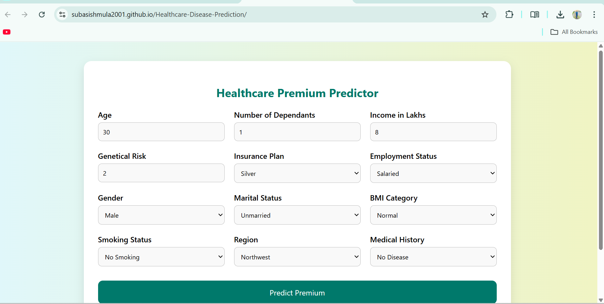
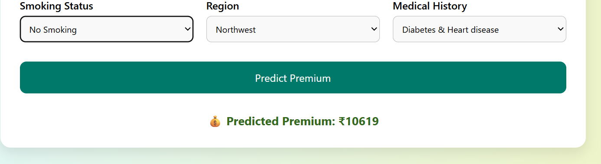

# 🩺 Healthcare Premium Prediction

A full-stack machine learning web application that predicts **health insurance premium** based on user inputs like age, income, medical history, BMI, smoking status, and more.

> This project was built as part of the Codebasics Machine Learning course with enhancements like:
> - Full frontend UI (HTML/CSS/JS)
> - Flask REST API backend
> - Fully deployed on Render and GitHub Pages

---

## 🚀 Live Demo

| Component    | URL |
|-------------|-----|
| 🌐 Frontend (GitHub Pages) | [Visit Site](https://subasishmula2001.github.io/Healthcare-Disease-Prediction) |
| ⚙️ Backend (Render)        | [API Endpoint](https://healthcare-disease-prediction.onrender.com) |

---

## 📌 Key Features

- 🧠 Predicts premium using ML models (XGBoost & Linear Regression)
- 🧑‍⚕️ Different models for users ≤25 and >25 years
- 📊 Inputs: Age, Income, Dependants, Medical History, Smoking, BMI, etc.
- 🔌 Backend built with Flask + joblib models
- 🌍 Hosted with GitHub Pages (frontend) + Render (backend)
- 📱 Responsive design with HTML/CSS
- 🔁 Works with Postman or fetch API

---

## 🛠️ Tech Stack

| Layer        | Tools Used                        |
|--------------|-----------------------------------|
| Machine Learning | Scikit-learn, XGBoost, Pandas |
| Backend (API)   | Flask, Flask-CORS, Python      |
| Frontend        | HTML, CSS, JavaScript          |
| Deployment      | Render (Flask API), GitHub Pages (HTML) |

---

## 📬 API Usage

### POST `/predict`

- **Headers:** `Content-Type: application/json`
- **URL:** `https://healthcare-disease-prediction.onrender.com/predict`

### ✅ Sample Input:

```json
{
  "Age": 30,
  "Number of Dependants": 2,
  "Income in Lakhs": 8,
  "Genetical Risk": 2,
  "Insurance Plan": "Silver",
  "Employment Status": "Salaried",
  "Gender": "Male",
  "Marital Status": "Married",
  "BMI Category": "Normal",
  "Smoking Status": "No Smoking",
  "Region": "Southeast",
  "Medical History": "Diabetes"
}
```

### ✅ Sample Response:

```json
{
  "predicted_premium": 16325
}
```

---

## 🧠 Model Details

- Two separate models:
  - `model_young.joblib` for users age ≤ 25
  - `model_rest.joblib` for users age > 25
- Scaling handled with:
  - `scaler_young.joblib`
  - `scaler_rest.joblib`
- Feature engineering includes:
  - Normalized genetical risk score
  - One-hot encoding for categorical fields

---

## 🖥️ Frontend

- Form with inputs for:
  - Age, Income, Dependants
  - BMI, Smoking, Gender, etc.
- Sends data to backend using `fetch()` with `POST` method
- Displays prediction result on submit
- Responsive design with some default values for quick demo

---

## 📷 Screenshots

> You can add real screenshots in the `/screenshots` folder and link here.

| Input Form | Prediction Output |
|------------|-------------------|
|  |  |

---

## ⚙️ Local Setup

### 🔧 Step-by-step

```bash
# 1. Clone the repo
git clone https://github.com/SubasishMula2001/Healthcare-Disease-Prediction.git
cd Healthcare-Disease-Prediction

# 2. Create virtual environment (optional)
python -m venv venv
source venv/bin/activate  # Windows: venv\Scripts\activate

# 3. Install dependencies
pip install -r requirements.txt

# 4. Run Flask backend
python app.py
```

### 🔗 Local URLs

- Frontend: Open `index.html` in browser
- Backend: `http://127.0.0.1:5000/predict`

---

## 🌍 Deployment

| Platform | Role          | Link |
|----------|---------------|------|
| **Render** | Flask Backend | [Backend API](https://healthcare-disease-prediction.onrender.com) |
| **GitHub Pages** | Frontend UI | [Frontend](https://subasishmula2001.github.io/Healthcare-Disease-Prediction) |

> Make sure your Render backend allows CORS and your GitHub Pages fetches from the correct API.

---

## 📦 Requirements

```
Flask
flask-cors
scikit-learn==1.3.0
xgboost==1.7.4
pandas
joblib
```

> ⚠️ Ensure your model `.joblib` files and scaler files are compatible with the library versions used.

---

## 🙋‍♂️ Author

**Subasish Mula**  
📧 subasishmula@gmail.com  
🔗 [GitHub](https://github.com/SubasishMula2001)

---

## 📄 License

This project is licensed under the **MIT License**.

---

### ⭐ If you found this helpful, give it a star!
